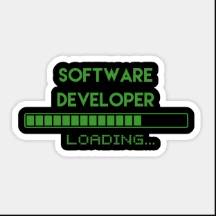

 
## Olá, meu nome é Raul Lima.  Atualmente estou em busca de novos conhecimentos e novas experiências profissionais como desenvolvedor front-end.

    <a href="https://github.com/github.com/Raullimaa">
    

        
 ## 
  

 
    
    
    
    
    

 

  

    
  

